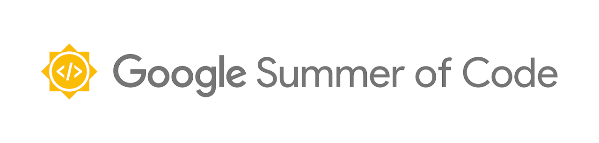

      
      
    <h2>
        Metrics Automated Release System 
    </h2>
	<a href="#project-abstract">Project Abstract</a> |
    <a href="#weekly-meetings">Weekly Meetings</a> |
    <a href="#weekly-updates">Weekly Upates</a> |
    <a href="#result">Result</a> |
    <a href="#links">Links</a>
     
    Weekly updates will be posted on my <a href="https://medium.com/@ritik18406">blog</a>

## Project Abstract

The aim of the CHAOSS community is to create analytics and metrics to help define the community health. And it is the reports that play the presentation part of any organization, giving a good overview of the whole community. These reports (in the form of metric release), communicate the information which has been compiled as a result of research and analysis of all the metrics defined so far.

Improving the metric release process and fully automating will not only save time, but it will also help us to define a central structure for the current as well as upcoming WGs/metrics. Keeping in mind the ever evolving CHAOSS, the process would be scalable and flexible enough for easy tweaking in future. The quality and the impression of the PDF would also be on equal priority.

Once the automatic metric release is implemented, we can extend this idea to automate the error handling and structuring of Working Groups and metrics. We can also automate the making of a new working group from a template rather than from scratch. We can try to get rid of typos and grammatical errors once and for all by including scripts for automated timely scanning and fixing of the working groups. A major chunk of these ideas will be decided by the community feedback.

## Mentors

* [Georg Link](https://github.com/georgLink)

* [Jaskirat Singh](https://github.com/jaskiratsingh2000)

* [Kevin Lumbard](https://github.com/klumb)

* [Matt Germonprez](https://github.com/germonprez)

## Prototype Pipeline

A prototype for this project was made during the the application review period. \
The same can be found in [this repository](https://github.com/ritik-malik/prototype-pipeline).

## Weekly Meetings

The offical weekly meetings for this project are being conducted on google-meet on Mondays at 9:00 am CDT / 2:00 pm UTC / 7:30 pm IST. \
The meeting minutes document can be found [here](https://docs.google.com/document/d/16SMMgMPzB1fz_On3KwGUI-Y3CrNwYnIgc-Avtj3JJ08/edit).

## Weekly Updates

| GSoC Acceptence | Time Duration | Blog |
| :-------------: | :--: | :--: |
| GSoC acceptance blog | May 17, 2021 | [link](https://ritik18406.medium.com/a-new-expedition-awaits-gsoc-21-639fc117e5a0) |

| Coding Period 1 | Time Duration | Blog |  Notes |
| :-------------: | :--: | :--: |  :---: |
| Week 1 | June 7  - June 13, 2021 | [link](https://ritik18406.medium.com/coding-period-1-week-1-e9ab9078d2d7) | [link](meetings/Coding_Period_1/week_1.md) |
| Week 2 | June 14 - June 20, 2021 | [link](https://ritik18406.medium.com/coding-period-1-week-2-9e65bca8c368) | [link](meetings/Coding_Period_1/week_2.md) |
| Week 3 | June 21 - June 27, 2021 | [link](https://ritik18406.medium.com/coding-period-1-week-3-f7f715f8f200) | [link](meetings/Coding_Period_1/week_3.md) |
| Week 4 | June 28 - July 4,  2021 | [link](https://ritik18406.medium.com/coding-period-1-week-4-11c9d4daeebc) | [link](meetings/Coding_Period_1/week_4.md) |
| Week 5 | July 5  - July 11, 2021 | [link](https://ritik18406.medium.com/coding-period-1-week-5-1d64c433a929) | [link](meetings/Coding_Period_1/week_5.md) |

| Coding Period 2 | Time Duration | Blog |  Notes |
| :-------------: | :--: | :--: |  :---: |
| Week 6  | July 12 - July 18, 2021 | [link](https://ritik18406.medium.com/coding-period-2-week-6-95fa52118ff4) | [link](meetings/Coding_Period_2/week_6.md) |
| Week 7  | July 19 - July 25, 2021 | [link](https://ritik18406.medium.com/coding-period-2-week-7-a0d498054184) | [link](meetings/Coding_Period_2/week_7.md) |
| Week 8  | July 26 - Aug 1, 2021   | [link](https://ritik18406.medium.com/coding-period-2-week-8-12e22d54b323) | [link](meetings/Coding_Period_2/week_8.md) |
| Week 9  | Aug 2 - Aug 8, 2021 | [link](https://ritik18406.medium.com/coding-period-2-week-9-fe703084df3e) | [link](meetings/Coding_Period_2/week_9.md) |
| Week 10 | Aug 9 - Aug 15 | [link](https://ritik18406.medium.com/coding-period-2-week-10-433cf5b98d3c) | [link](meetings/Coding_Period_2/week_10.md) |

| GSoC Conclusion | Time Duration | Blog |
| :-------------: | :--: | :--: |
| GSoC Conclusion blog | Aug 21, 2021 | [link](https://ritik18406.medium.com/gsoc-21-the-conclusion-bdbb0c1d082c) |

## Result

The project is offically completed and I passed all the evaluations!

The final project on the GSoC website can be found [here](https://summerofcode.withgoogle.com/projects/#6676319141625856).

My final report for GSoC '21 can be found [here](https://gist.github.com/ritik-malik/5a1a48bb966892824d7da31fc12ede50).

The final blog can be found [here](https://ritik18406.medium.com/gsoc-21-the-conclusion-bdbb0c1d082c).

## Links

* [Project Link on GSoC website](https://summerofcode.withgoogle.com/projects/#6676319141625856)
* [CHAOSS MARS Repository](https://github.com/chaoss/mars)
* [Project Selection Link](https://summerofcode.withgoogle.com/projects/#6676319141625856)
* [Microtask Repository](github.com/ritik-malik/microtasks)
* [Project Proposal](https://drive.google.com/file/d/1HJ2tHSVkZ3TJQUNDrmucDKkGXSVLQlr1/view?usp=sharing)
* [Meduim Blogs](https://ritik18406.medium.com/)
* [Final Report](https://gist.github.com/ritik-malik/5a1a48bb966892824d7da31fc12ede50)
